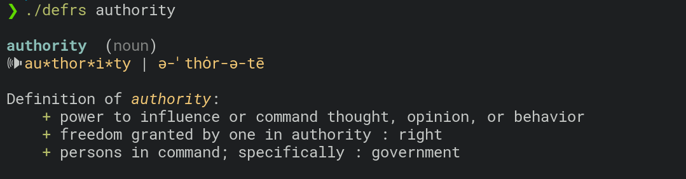
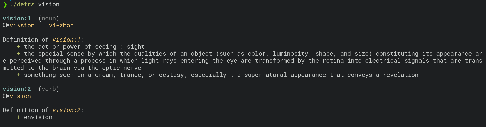

# Define

a small cli tool that uses merriam-webster API to get the meaning of a word.
this tool doesn't scrape, it uses API so you'll need your own API key to work, it's fairly easy to get one.

## Get API key:
go to [dictionaryapi.com](https://dictionaryapi.com/register/index) 
fill in the basic information you need, here `Request API key (1)` will be `Collegiage Dictionary`. (2) can 
be anything we just need (1).
And after that you should receive your KEY. export it like
```
export DICTIONARY_KEY="1234-1234-1234-etc"
```
or set in your `.bashrc` or `.zshrc` etc.


## Installation
if you have cargo installed, just run
```
cargo install --git https://github.com/fosslife/define
```

if you have cloned the repo locally you can also run
```
cargo install --path .
```

## Usage
```
defrs {word}
```

example:
```
$ defrs humanity
hu*man*i*ty | hyü-ˈma-nə-tē

Definition of humanity:
    + compassionate, sympathetic, or generous behavior or disposition : the quality or state of being humane
    + the quality or state of being human
    + human attributes or qualities
```

## Screenshots 





# License
This project is licensed under MIT
